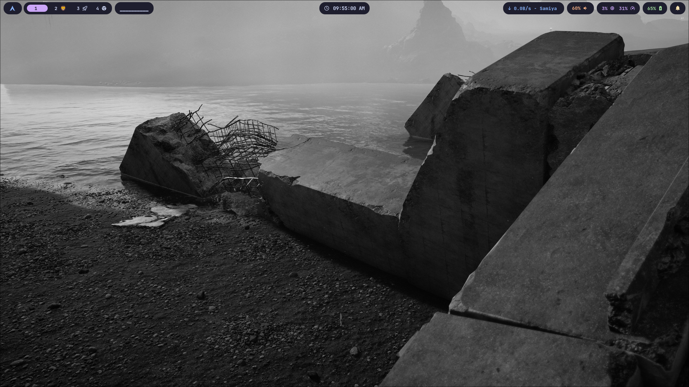
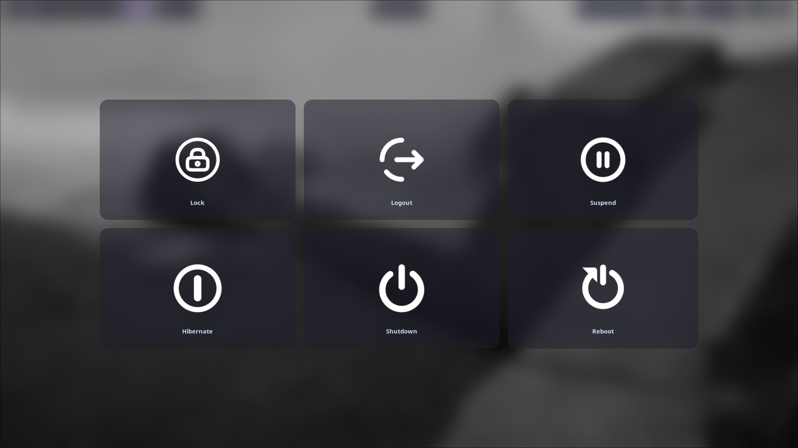
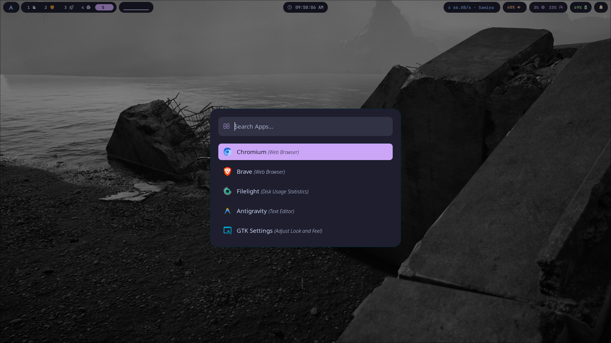
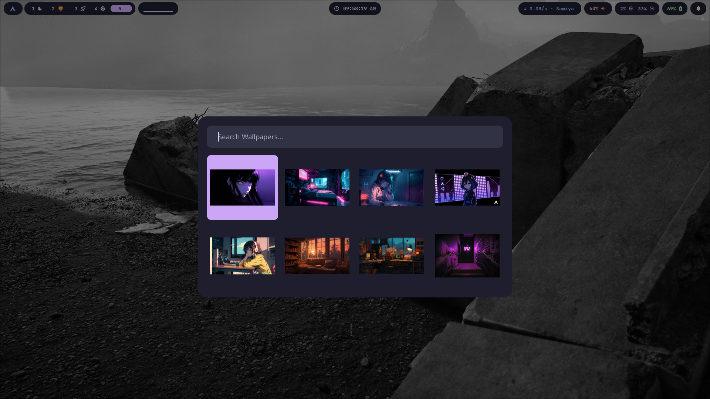

# Onyxshell

Onyxshell is a beautiful, modular, and modern dotfiles configuration for the [Hyprland](https://hyprland.org/) Wayland compositor. Focused on smooth animations, seamless workflows, and striking visuals.

## Screenshots

<div align="center">
  
  <br><em>Full Desktop</em><br><br>
  
  
  <br><em>Logout Menu (wlogout)</em><br><br>

  
  <br><em>App Launcher (Rofi)</em><br><br>

  
  <br><em>Wallpaper Picker</em>
</div>

## Features

- **Window Manager:** Hyprland (Wayland)
- **Bar/Panel:** Waybar
- **App Launcher / Menus:** Rofi
- **Terminal:** Kitty
- **Dropdown Terminal:** Kitty + pyprland
- **File Manager:** Yazi
- **Clipboard Manager:** Cliphist
- **Notifications:** Swaync
- **Wallpapers:** swww _(Note: Place your wallpapers in `~/Pictures/Images` for the wallpaper picker to detect them)_
- **Screen Locker:** Hyprlock
- **Screenshot:** Hyprshot
- **Logout Menu:** wlogout

## Prerequisites

Onyxshell is built to be installed on **Arch Linux**. The included installation script handles installing the required dependencies via `pacman` and `yay` (AUR).

### Manual Dependency List (If not using the script)

- Base packages: `hyprland`, `hyprlock`, `hyprshot`, `kitty`, `yazi`, `rofi`, `waybar`, `swaync`, `wl-clipboard`, `cliphist`, `playerctl`, `brightnessctl`, `wireplumber`, `network-manager-applet`, `awww`, `cava`, `gnome-keyring`, `libnotify`, `pavucontrol`
- Fonts: `ttf-jetbrains-mono-nerd`, `noto-fonts-emoji`
- AUR packages: `brave-bin`, `wlogout`, `pyprland`

## Installation

You can install Onyxshell automatically using the provided `install.sh` script.

### 1-Command Automatic Install (Arch Linux)

Run the following command in the root of this repository:

```bash
git clone https://github.com/sadid56/onyxshell.git
cd onyxshell
chmod +x install.sh && ./install.sh
```

**What the script does:**

1. Updates your system packages (`pacman -Syu`).
2. Installs the `yay` AUR helper if it's not already installed.
3. Installs all required official and AUR packages.
4. Backs up your existing configurations to `~/.config/onyxshell_backup_...`.
5. Copies all Onyxshell configs to `~/.config/`.
6. Sets the necessary execution permissions for scripts.

---

## Default Keybindings

Here is a quick cheat sheet for the default keybinds. You can also view these in your setup by pressing `Super + /`.

### App Launchers

| Binding       | Action                     |
| ------------- | -------------------------- |
| `Super + Q`   | Open Terminal (Kitty)      |
| `Super + E`   | Open File Manager (Thunar) |
| `Alt + Space` | Open App Launcher (Rofi)   |
| `Super + B`   | Open Browser (Brave)       |
| `Super + L`   | Lock Screen (Hyprlock)     |

### System & Media

| Binding             | Action                                   |
| ------------------- | ---------------------------------------- |
| `Super + M`         | Open Logout Menu (wlogout)               |
| `Super + Shift + W` | Cycle Wallpaper                          |
| `Super + N`         | Open Notification Center (Swaync)        |
| `Super + V`         | Open Clipboard History (Rofi + cliphist) |
| `Super + Shift + V` | Clear Clipboard History                  |
| `Super + Print`     | Screenshot Window                        |
| `Super + Shift + S` | Screenshot Region                        |

### Window Management

| Binding                      | Action                           |
| ---------------------------- | -------------------------------- |
| `Super + X`                  | Close Active Window              |
| `Super + Space`              | Toggle Floating Window           |
| `Super + F`                  | Toggle Fullscreen                |
| `Super + J`                  | Toggle Split                     |
| `Super + A`                  | Window Switcher (Rofi)           |
| `Super + Arrows`             | Move Focus (Left/Right/Up/Down)  |
| `Super + Ctrl + Arrows`      | Move Window (Left/Right/Up/Down) |
| `Super + Shift + Arrows`     | Resize Window                    |
| `Super + Left Mouse (Drag)`  | Move Window                      |
| `Super + Right Mouse (Drag)` | Resize Window                    |

### Workspaces

| Binding               | Action                                  |
| --------------------- | --------------------------------------- |
| `Super + 1-0`         | Switch to Workspace 1-10                |
| `Super + Shift + 1-0` | Move Window to Workspace 1-10           |
| `Super + Tab`         | Switch to Previous Workspace            |
| `Alt + S`             | Toggle Special Workspace (Scratchpad)   |
| `Alt + Shift + S`     | Move Window to Special Workspace        |
| `Alt + Shift + Y`     | Move Window back from Special Workspace |
| `Super + Scroll`      | Scroll Workspaces                       |

---

## File Structure

- `config/hypr/`: Main Hyprland configurations (modularized).
- `config/waybar/`: Waybar themes and settings.
- `config/rofi/`: Rofi themes and configurations for menus/launchers.
- `config/swaync/`: Notification center configurations.
- `config/wlogout/`: Custom logout menu styles.
- `install.sh`: The 1-step installation script.

Enjoy your new setup!
