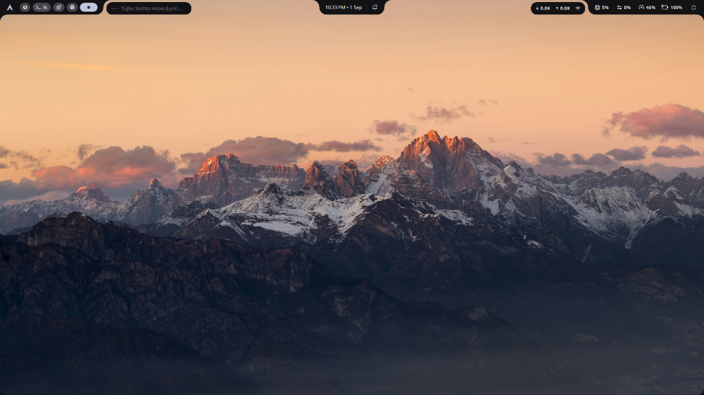
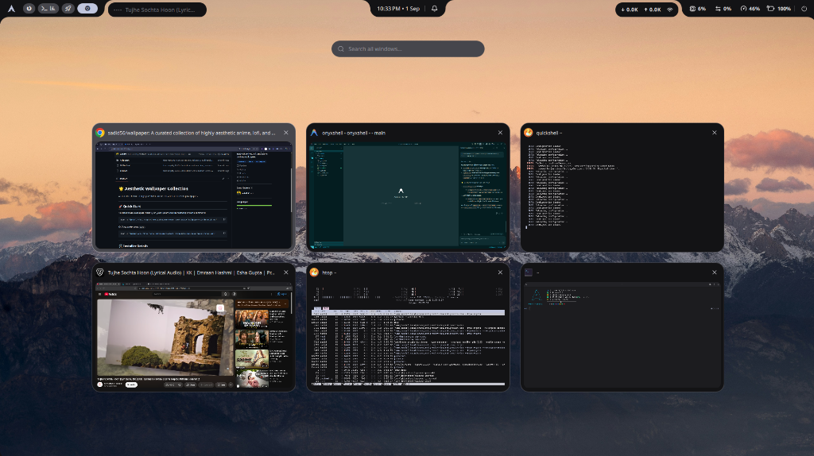

# ❄️ Onyxshell

<div align="center">


**An ultra-modern, fluid, and battery-efficient desktop suite for Hyprland powered by Quickshell. Tailored for daily driving with seamless animations, dynamic island notch bar, interactive overview, and Material You theming — with modular multi-distro installation support.**

<br />

<p align="center">
  
</p>

<br />

<p align="center">
  
</p>

</div>

---

## ✨ Key Highlights

- 🏝️ **Dynamic Island Notch Top Bar**: 
  - **Left Island**: Distro branding, real-time workspace switcher, active window title pill, and event-driven MPRIS media controls.
  - **Center Notch**: Sleek clock and date pill expanding into the Quick Settings & Notification Center with sliders for volume, microphone, brightness, and night light.
  - **Right Island**: Real-time network speed telemetry, system resource indicators (CPU, RAM, Battery), system tray island pill, and power menu.
- 🪟 **Interactive Window Overview (`SUPER` / `SUPER + A`)**:
  - Live window thumbnail previews arranged in an adaptive responsive grid.
  - Instant window search bar to filter and focus running applications effortlessly.
  - One-click window close and workspace switching.
- ⚡ **Scratchpad & Dropdown Terminal**:
  - Dedicated dropdown terminal toggle (`SUPER + Q`).
  - Special workspace (`special:magic`) with quick move (`SUPER + CTRL + S`) and return shortcuts (`SUPER + CTRL + Y`).
- 🔄 **macOS-Style Alt+Tab Window Switcher**:
  - Fast quick-switching and visual preview card navigation across open windows.
- 📋 **Integrated Clipboard & Emoji Pickers**:
  - Instant searchable clipboard manager (`SUPER + V`) with cliphist integration.
  - Built-in emoji picker (`SUPER + ,`).
- 🌙 **Native Night Light (Hyprsunset)**:
  - Zero-lag hardware-accelerated blue light filter with color temperature slider and persistent state management.
- 🔤 **Crisp Font Rendering**:
  - Preconfigured fontconfig, JetBrains Mono Nerd Font, Noto fonts, and Qt5/Qt6 unified styling.

---

## 📦 Installation

Onyxshell includes an organic, modular installer with automated distribution detection and package management for **Arch Linux**, **Fedora**, and **openSUSE**.

```bash
git clone https://github.com/sadid56/onyxshell.git ~/onyxshell
cd ~/onyxshell
chmod +x install.sh
./install.sh
```

### 🔧 What the installer does:
1. **Distro Detection**: Automatically recognizes your distribution (`arch`, `fedora`, `opensuse`) and uses the appropriate native package manager (`pacman`, `dnf`, `zypper`).
2. **Package Setup**: Installs all required core dependencies without requiring any AUR helpers on Arch Linux.
3. **Safe Backup**: Automatically creates a timestamped backup of existing configs in `~/.config/onyxshell_backup_<timestamp>`.
4. **Dotfile Deployment**: Deploys configurations to `~/.config/` and sets proper script executable permissions.
5. **Display Manager**: Organically checks for active login managers (`sddm`, `gdm`, `greetd`, etc.) and optionally configures `greetd` (`tuigreet`) if no DM is active.
6. **Shell Setup**: Prompts to configure `fish` as your default shell.
7. **Wallpapers (Recommended)**: Prompts to download and install the curated wallpaper collection.

---

## 🖼️ Wallpaper Collection (Recommended)

Onyxshell integrates seamlessly with the official aesthetic wallpaper collection. You can install it anytime using:

```bash
bash -c "$(curl -fsSL https://raw.githubusercontent.com/sadid56/wallpaper/main/install.sh)"
```

---

## ⌨️ Keybindings

All default shortcuts, window navigation rules, workspace gestures, and multimedia keys are fully documented in the dedicated Keybindings guide:

👉 **[View Full Keybindings Reference (KEYBINDS.md)](KEYBINDS.md)**

### Essential Shortcuts at a Glance

| Shortcut | Action |
| :--- | :--- |
| `SUPER` or `SUPER + A` | **Toggle Full Window Overview** |
| `SUPER + RETURN` | Open Default Terminal (Kitty) |
| `ALT + SPACE` | Open Quickshell App Dashboard |
| `SUPER + Q` | Toggle Dropdown Scratchpad Terminal |
| `SUPER + X` | Close Focused Window |
| `SUPER + SPACE` | Toggle Window Floating |
| `SUPER + S` | Toggle Special Workspace (Scratchpad) |
| `SUPER + V` | Open Clipboard History |
| `SUPER + ,` | Open Emoji Picker |
| `SUPER + N` | Open Notification Center & Quick Settings |
| `SUPER + M` | Open Power Menu |

---

## 🔄 Sync & Update

To synchronize your live `~/.config/` modifications back into the local `onyxshell` repository:

```bash
cd ~/onyxshell
./update.sh
```
