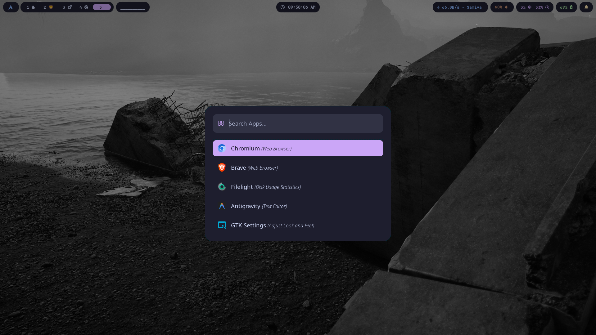
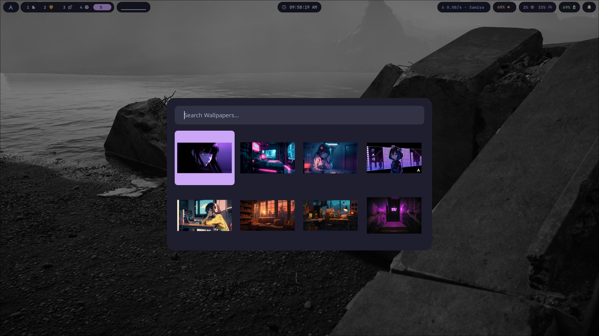

# ❄️ Onyxshell

<div align="center">


**A sleek, modular, and dynamic desktop suite for Hyprland powered by Quickshell and modern Lua configuration.**

[Features](#-features) • [Installation](#-installation) • [Keybindings](#-keybindings) • [Customization](#-customization)

---

</div>

## 📸 Screenshots

<div align="center">
  
  <p><em>Full Desktop with Quickshell Modular Bar & Dynamic Theme</em></p>
</div>

<div align="center">
  
  
  <p><em>Modular App Launcher & Dynamic Wallpaper Selector</em></p>
</div>

---

## ✨ Features

- **Compositor:** [Hyprland](https://hyprland.org/) configured with clean, modular **Lua** scripts.
- **Desktop Shell:** Custom [Quickshell](https://git.outfoxxed.me/quickshell/quickshell) QtQuick/QML modular suite:
  - 🚀 **App Launcher:** Fast fuzzy search with desktop categories and keyboard navigation (`Alt + Space`).
  - 📊 **Status Bar:** Dynamic workspaces, active window title, system telemetry, clock, and quick tray popups.
  - 📋 **Clipboard Manager:** Searchable clipboard history with inline image thumbnails (`Super + V`).
  - 🎛️ **Control Center:** Quick action toggles, live media controls, volume/brightness sliders, and power grid (`Super + M`).
  - 🔔 **Notification Center & Toast HUD:** Interactive notifications with actions, mute toggles, and smooth popup animations (`Super + N`).
  - 📶 **Live Wi-Fi Manager:** Scan, select, and connect to Wi-Fi networks directly from the bar.
  - 🖼️ **Wallpaper Selector:** Visual thumbnail wallpaper gallery with automatic [Matugen](https://github.com/InioX/matugen) dynamic palette generation (`Super + Shift + W`).
  - ⌨️ **Keybinds Cheat Sheet HUD:** Instant search popup displaying all configured keybindings (`Super + /`).
- **Terminal:** [Kitty](https://sw.kovidgoyal.net/kitty/) with dropdown terminal scratchpad (`Super + Q`).
- **Wallpaper Engine:** `awww` (`awww-daemon`) with smooth transitions.
- **Dynamic Theming:** `matugen` material color palette extraction synchronized across Quickshell, Kitty, and desktop components.
- **Screen Locker & Idle:** `hyprlock` & `hypridle`.
- **Screenshots:** `hyprshot` with region, window, and full-screen capture (`Super + Shift + S`).
- **Shell & Prompt:** `zsh` + Oh-My-Zsh + `powerlevel10k` + autosuggestions + syntax highlighting.

---

## 📦 Prerequisites

Onyxshell is optimized for **Arch Linux** (and derivatives such as CachyOS, EndeavourOS, and Manjaro), with support for Fedora and Debian/Ubuntu.

### Core Dependencies Overview

| Component | Arch Package | Fedora Package | Debian / Ubuntu Package |
| :--- | :--- | :--- | :--- |
| **Compositor** | `hyprland` | `hyprland` | `hyprland` |
| **Desktop Shell** | `quickshell` | COPR / source | source / binary |
| **Wallpaper Engine** | `awww` | COPR / cargo | cargo / binary |
| **Theme Engine** | `matugen` | COPR / cargo | cargo / binary |
| **Screen Lock & Idle**| `hyprlock hypridle` | `hyprlock hypridle` | source / binary |
| **Terminal** | `kitty` | `kitty` | `kitty` |
| **Clipboard** | `wl-clipboard cliphist` | `wl-clipboard cliphist` | `wl-clipboard cliphist` |
| **Screenshots** | `hyprshot grim slurp` | `grim slurp` | `grim slurp` |
| **Audio & Media** | `wireplumber playerctl pavucontrol` | `wireplumber playerctl pavucontrol` | `wireplumber playerctl pavucontrol` |
| **Polkit & Keyring** | `hyprpolkitagent gnome-keyring` | `gnome-keyring` | `gnome-keyring` |
| **Fonts** | `ttf-jetbrains-mono-nerd noto-fonts-emoji` | `jetbrains-mono-fonts-all google-noto-emoji-fonts` | `fonts-jetbrains-mono fonts-noto-color-emoji` |

---

## 🚀 Installation

### Automated 1-Step Install (Recommended)

Clone the repository and run the interactive setup script:

```bash
git clone https://github.com/sadid56/onyxshell.git
cd onyxshell
chmod +x install.sh
./install.sh
```

> [!TIP]
> For non-interactive automated installs (accepting all prompts), use `./install.sh --yes`.

### What `install.sh` handles:
1. Detects your distribution and updates package manager repositories.
2. Installs required system packages, Wayland tools, QML runtimes, and nerd fonts.
3. Configures Oh-My-Zsh, plugins (`zsh-autosuggestions`, `zsh-syntax-highlighting`), and `powerlevel10k`.
4. Creates automatic timestamped backups of any existing `~/.config/` configurations.
5. Deploys Onyxshell configuration folders to `~/.config/`.
6. Sets up `~/Pictures/Images` and `~/Pictures/Screenshots` with default wallpapers.
7. Enables essential background services (`power-profiles-daemon`, `bluetooth`).
8. Configures executable permissions for all custom scripts.

---

## ⌨️ Keybindings

Press <kbd>Super</kbd> + <kbd>/</kbd> at any time inside Hyprland to bring up the interactive Keybinds HUD.

### 🚀 App Launchers & Menus

| Keybinding | Action |
| :--- | :--- |
| <kbd>Alt</kbd> + <kbd>Space</kbd> | **Quickshell App Launcher** |
| <kbd>Super</kbd> + <kbd>Return</kbd> | Open Terminal (`kitty`) |
| <kbd>Super</kbd> + <kbd>Q</kbd> | Toggle Dropdown Quake Terminal |
| <kbd>Super</kbd> + <kbd>E</kbd> | Open File Manager (`nautilus`) |
| <kbd>Super</kbd> + <kbd>B</kbd> | Open Web Browser (`brave`) |
| <kbd>Super</kbd> + <kbd>L</kbd> | Lock Screen (`hyprlock`) |
| <kbd>Super</kbd> + <kbd>/</kbd> | Show Keybindings Cheat Sheet |

### 🎛️ Desktop, Media & System Controls

| Keybinding | Action |
| :--- | :--- |
| <kbd>Super</kbd> + <kbd>M</kbd> | Toggle Control Center |
| <kbd>Super</kbd> + <kbd>N</kbd> | Toggle Notification Center |
| <kbd>Super</kbd> + <kbd>V</kbd> | Toggle Clipboard Manager |
| <kbd>Super</kbd> + <kbd>Shift</kbd> + <kbd>V</kbd> | Clear Clipboard History |
| <kbd>Super</kbd> + <kbd>Shift</kbd> + <kbd>W</kbd> | Toggle Wallpaper Selector |
| <kbd>Super</kbd> + <kbd>Shift</kbd> + <kbd>B</kbd> | Toggle Status Bar Visibility |
| <kbd>Super</kbd> + <kbd>Shift</kbd> + <kbd>R</kbd> | Reload Desktop & Shell Configuration |
| <kbd>Super</kbd> + <kbd>Shift</kbd> + <kbd>E</kbd> | Graceful System Shutdown |
| <kbd>Super</kbd> + <kbd>Shift</kbd> + <kbd>S</kbd> | Region Screenshot (`hyprshot`) |
| <kbd>Super</kbd> + <kbd>Print</kbd> | Window Screenshot |
| <kbd>Super</kbd> + <kbd>R</kbd> | Open Floating System Monitor (`sysmon.sh`) |
| <kbd>XF86AudioRaiseVolume</kbd> / <kbd>Lower</kbd> | Volume Up / Down (`wpctl`) |
| <kbd>XF86AudioMute</kbd> / <kbd>MicMute</kbd> | Mute Audio / Microphone |
| <kbd>XF86MonBrightnessUp</kbd> / <kbd>Down</kbd> | Screen Brightness Up / Down (`brightnessctl`) |

### 🪟 Window Management

| Keybinding | Action |
| :--- | :--- |
| <kbd>Super</kbd> + <kbd>X</kbd> | Close Active Window |
| <kbd>Super</kbd> + <kbd>Space</kbd> | Toggle Floating Window |
| <kbd>Super</kbd> + <kbd>F</kbd> | Toggle Fullscreen |
| <kbd>Super</kbd> + <kbd>J</kbd> | Toggle Split Direction |
| <kbd>Super</kbd> + <kbd>G</kbd> | Toggle Window Group |
| <kbd>Super</kbd> + <kbd>Arrow Keys</kbd> | Move Window Focus |
| <kbd>Super</kbd> + <kbd>Ctrl</kbd> + <kbd>Arrow Keys</kbd> | Move Window Position |
| <kbd>Super</kbd> + <kbd>Shift</kbd> + <kbd>Arrow Keys</kbd> | Resize Window |
| <kbd>Super</kbd> + <kbd>Left Mouse Drag</kbd> | Drag & Move Window |
| <kbd>Super</kbd> + <kbd>Right Mouse Drag</kbd> | Resize Window |

### 🧭 Workspaces

| Keybinding | Action |
| :--- | :--- |
| <kbd>Super</kbd> + <kbd>1</kbd> - <kbd>9</kbd>, <kbd>0</kbd> | Switch to Workspace 1–10 |
| <kbd>Super</kbd> + <kbd>Shift</kbd> + <kbd>1</kbd> - <kbd>9</kbd>, <kbd>0</kbd> | Move Window to Workspace 1–10 |
| <kbd>Super</kbd> + <kbd>Tab</kbd> | Switch to Previous Workspace |
| <kbd>Alt</kbd> + <kbd>S</kbd> | Toggle Special Workspace (Scratchpad) |
| <kbd>Alt</kbd> + <kbd>Shift</kbd> + <kbd>S</kbd> | Move Window to Special Workspace |
| <kbd>Super</kbd> + <kbd>Scroll Up/Down</kbd> | Cycle Workspaces |

---

## 🎨 Customization & Theming

### Changing Wallpapers & Colors
- Press <kbd>Super</kbd> + <kbd>Shift</kbd> + <kbd>W</kbd> to open the Wallpaper Selector.
- Select any wallpaper from your `~/Pictures/Images` directory.
- `matugen` will automatically generate harmonized color palettes in `.config/quickshell/colors.json` and synchronize them with Kitty and Quickshell components in real time.

### Updating Your Configs
To synchronize local changes back to your repository and push updates:
```bash
./update.sh
```

---

## 📜 License

This project is licensed under the [MIT License](LICENSE). Feel free to customize and make it your own!
