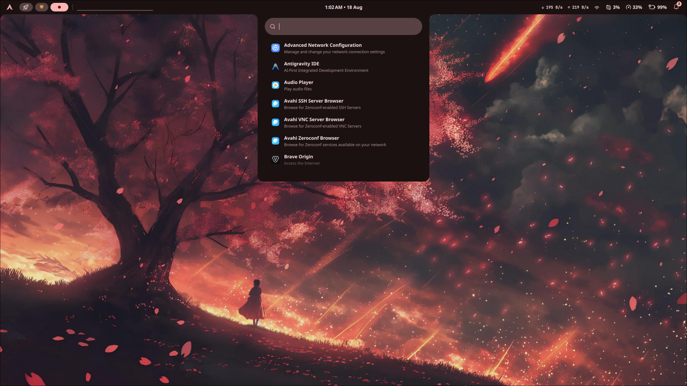
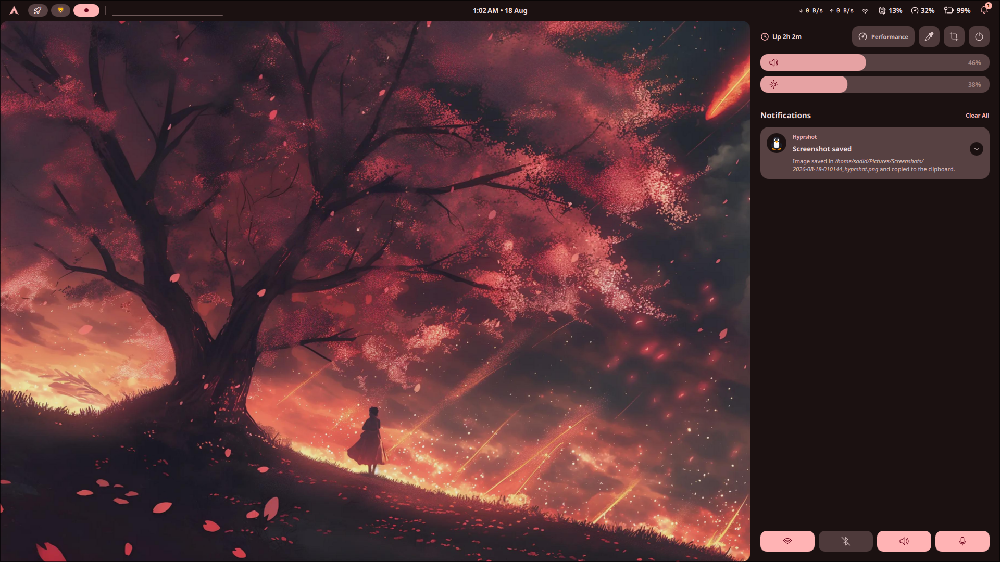
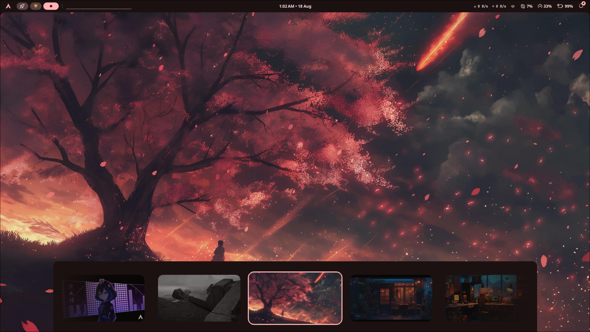
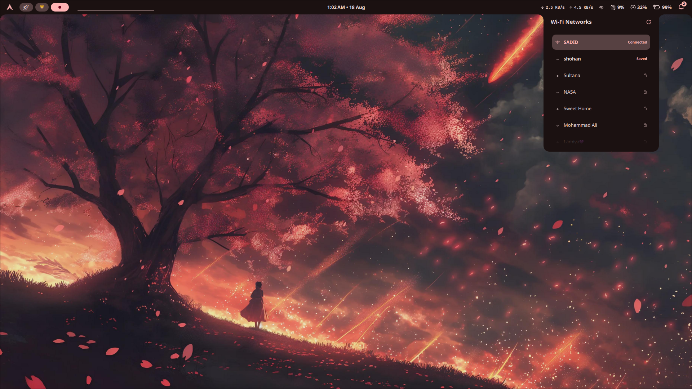

# ❄️ Onyxshell

<div align="center">


**A sleek, modular, and dynamic desktop suite for Hyprland — crafted for daily driving with maximum stability, fluid animations, and modern aesthetics.**

[Features](#-features) • [1-Line Installation](#-installation) • [Keybindings](#-keybindings) • [Customization](#-customization)

---

</div>

## 📸 Screenshots

<table align="center">
  <tr>
    <td align="center" width="50%">
      
      <p><em>App Launcher</em></p>
    </td>
    <td align="center" width="50%">
      
      <p><em>Control Center</em></p>
    </td>
  </tr>
  <tr>
    <td align="center" width="50%">
      
      <p><em>Wallpaper Selector</em></p>
    </td>
    <td align="center" width="50%">
      
      <p><em>Wi-Fi Menu</em></p>
    </td>
  </tr>
</table>

---

## ✨ Features

- **Compositor:** [Hyprland](https://hyprland.org/) configured with clean, modular **Lua** scripts.
- **Desktop Shell:** Custom [Quickshell](https://git.outfoxxed.me/quickshell/quickshell) QtQuick/QML modular suite:
  - 🚀 **App Launcher:** Fast fuzzy search with desktop categories and keyboard navigation (`Alt + Space`).
  - 📊 **Status Bar:** Dynamic workspaces, active window title, system telemetry, clock, and quick tray popups.
  - 📋 **Clipboard Manager:** Searchable clipboard history with inline image thumbnails (`Super + V`).
  - 🎛️ **Control Center:** Quick action toggles, live media controls, volume/brightness sliders, and power grid (`Super + M`).
  - 🔔 **Notification Center & Toast HUD:** Interactive notifications with actions, mute toggles, and smooth popup animations (`Super + N`).
  - 📶 **Live Wi-Fi Manager:** Scan, select, and connect to Wi-Fi networks directly from the bar.
  - 🖼️ **Wallpaper Selector:** Visual thumbnail wallpaper gallery with automatic [Matugen](https://github.com/InioX/matugen) dynamic palette generation (`Super + Shift + W`).
  - ⌨️ **Keybinds Cheat Sheet HUD:** Instant search popup displaying all configured keybindings (`Super + /`).
- **Terminal:** [Kitty](https://sw.kovidgoyal.net/kitty/) with dropdown terminal scratchpad (`Super + Q`).
- **Shell & Prompt:** [Fish Shell](https://fishshell.com/) & [Starship Prompt](https://starship.rs/) with fuzzy finding (`fzf`), Matugen live colors, and productivity aliases.
- **Wallpaper Engine:** Native [Quickshell](https://git.outfoxxed.me/quickshell/quickshell) background renderer with fluid animated crossfades and live Matugen theming.
- **Dynamic Theming:** `matugen` material color palette extraction synchronized across Quickshell, Hyprland Lua, Kitty, Fish, and desktop components.
- **Screen Locker & Idle:** `hyprlock` & `hypridle`.
- **Screenshots:** `hyprshot` with region, window, and full-screen capture (`Super + Shift + S`).

---

## 🚀 Installation

### ⚡ 1-Line Quick Install

Run this single command in your terminal to clone and install 100% of the desktop environment:

```bash
bash -c "$(curl -fsSL https://raw.githubusercontent.com/sadid56/onyxshell/main/install.sh)"
```

Or for automated installation accepting all defaults without prompts:

```bash
bash -c "$(curl -fsSL https://raw.githubusercontent.com/sadid56/onyxshell/main/install.sh)" -- --yes
```

---

### 📦 Manual Installation

```bash
git clone https://github.com/sadid56/onyxshell.git
cd onyxshell
chmod +x install.sh
./install.sh
```


---

## ⌨️ Keybindings

Press <kbd>Super</kbd> + <kbd>/</kbd> at any time inside Hyprland to bring up the interactive Keybinds HUD.

### 🚀 App Launchers & Menus

| Keybinding | Action |
| :--- | :--- |
| <kbd>Alt</kbd> + <kbd>Space</kbd> | **Quickshell App Launcher** |
| <kbd>Super</kbd> + <kbd>Return</kbd> | Open Terminal (`kitty`) |
| <kbd>Super</kbd> + <kbd>Q</kbd> | Toggle Dropdown Quake Terminal |
| <kbd>Super</kbd> + <kbd>E</kbd> | Open File Manager (`nautilus`) |
| <kbd>Super</kbd> + <kbd>B</kbd> | Open Web Browser (`firefox`) |
| <kbd>Super</kbd> + <kbd>L</kbd> | Lock Screen (`hyprlock`) |
| <kbd>Super</kbd> + <kbd>/</kbd> | Show Keybindings Cheat Sheet |


---

## 🎨 Customization & Theming

### Changing Wallpapers & Dynamic Colors
- Press <kbd>Super</kbd> + <kbd>Shift</kbd> + <kbd>W</kbd> to open the Wallpaper Selector.
- Select any wallpaper from your `~/Pictures/wallpapers` directory.
- `matugen` will automatically generate harmonized color palettes in `.config/quickshell/colors.json`, `~/.config/kitty/kitty-colors.conf`, and `~/.config/fish/conf.d/matugen_colors.fish` in real time.


---

## 🙏 Credits & Acknowledgements

> [!NOTE]
> This configuration and desktop suite is inspired by:
> - [caelestia-dots / caelestia-shell](https://github.com/caelestia-dots/shell) – Beautiful Quickshell components and design patterns.
> - [end-4 / dots-hyprland](https://github.com/end-4/dots-hyprland) – Incredible Hyprland desktop experience, theming workflows, and aesthetic inspiration.

---

## 📜 License

This project is licensed under the [MIT License](LICENSE).
